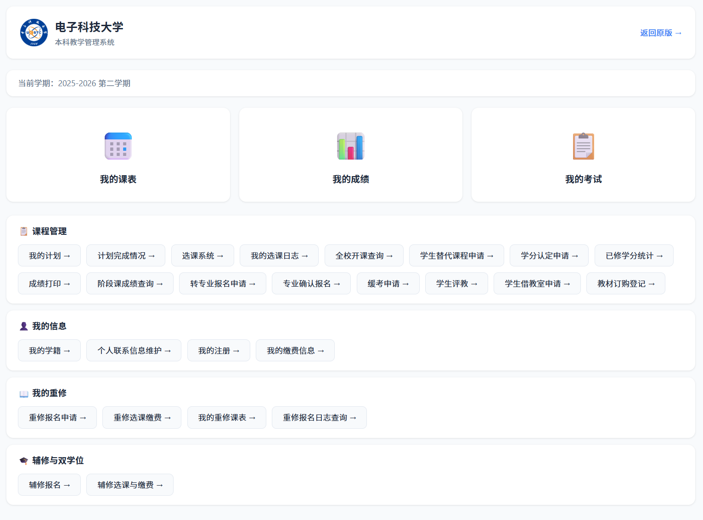

# uestc-eams-extension

**电子科技大学本科教学管理系统浏览器插件**

拦截原页面，用现代化 UI 完全重制课表/成绩/考试页面

UI 支持高度自定义

---

## ✨ 特性

- **成绩页** — 学期切换 · GPA/加权平均/学分统计 · 排除课程重算 · 平时成绩合并
- **课表页** — 学生/班级课表切换 · 7×12 网格 · rowspan 合并 · 周次选择
- **考试页** — 学期/考试类型切换 · 倒计时显示
- **Dashboard** — 核心入口 + 26 项原系统功能链接（按分类组织）

## 🖼️ 示例页面截图



## 📦 安装

```bash
# 1. 克隆仓库
git clone https://github.com/Corundum-Ling/uestc-eams-extension.git

# 2. 加载到浏览器
# Edge → edge://extensions/ （开启开发者模式 → 加载已解压的扩展）
# Chrome → chrome://extensions/ （开启开发者模式 → 加载已解压的扩展）
```

## 🎨 自定义

UI 与数据逻辑完全分离。修改外观只需编辑：

- `content/styles.css` — 样式（CSS 变量主题）
- `content/main.js` → `Templates` 对象 — 页面 HTML 模板

详细说明见 [`UI自定义指南.md`](UI自定义指南.md)。


## 🛠️ 技术方案

- **架构**：Content Script Hook — 注入后完全替换页面 DOM
- **数据**：fetch EAMS HTML 端点 + DOM 解析（无 JSON API）
- **渲染**：原生 HTML/CSS/JS，模板字符串，零依赖
- **状态**：localStorage 持久化 + sessionStorage 会话
- **样式**：CSS 变量主题，响应式布局

## 📄 许可证

本项目基于 [MIT License](https://opensource.org/licenses/MIT) 开源。
